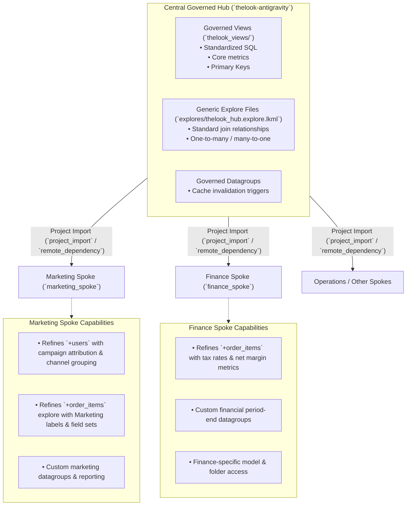

# Hub & Spoke Architecture in Looker: Complete Demo Guide

This document outlines the **Hub and Spoke** implementation in Looker based on best practices and Spencer Taylor's architectural framework.

---

## 1. Architectural Concept



### Core Rule of Hub & Spoke:
- **Central Governance (The Hub)**: Owns the Single Source of Truth for raw data models, primary keys, core views, and governed joins.
- **Departmental Agility (The Spokes)**: Spokes import the Hub's code, extending/refining it for departmental needs without the ability to modify the Hub's codebase or pollute other spokes.

---

## 2. Key Components Implemented in this Repository

| Component | File Path | Purpose |
| :--- | :--- | :--- |
| **Hub Manifest** | [`manifest.lkml`](file:///Users/sampitcher/Documents/Projects/thelook-antigravity/manifest.lkml) | Declares `project_name: "thelook-antigravity"` for import. |
| **Hub Governed Views** | [`thelook_views/*.view.lkml`](file:///Users/sampitcher/Documents/Projects/thelook-antigravity/thelook_views) | Standardized, validated views with explicit primary keys and metrics. |
| **Hub Explores** | [`explores/thelook_hub.explore.lkml`](file:///Users/sampitcher/Documents/Projects/thelook-antigravity/explores/thelook_hub.explore.lkml) | Modular, reusable explore definitions ready to be imported across models. |
| **Hub Model** | [`models/thelook.model.lkml`](file:///Users/sampitcher/Documents/Projects/thelook-antigravity/models/thelook.model.lkml) | Central production model including governed views and hub explores. |
| **Marketing Spoke View** | [`thelook_spoke_views/marketing_users.view.lkml`](file:///Users/sampitcher/Documents/Projects/thelook-antigravity/thelook_spoke_views/marketing_users.view.lkml) | Refines `+users` with channel groupings and acquisition measures. |
| **Finance Spoke View** | [`thelook_spoke_views/finance_order_items.view.lkml`](file:///Users/sampitcher/Documents/Projects/thelook-antigravity/thelook_spoke_views/finance_order_items.view.lkml) | Refines `+order_items` with tax liability and net revenue calculations. |
| **Marketing Model** | [`models/marketing_spoke.model.lkml`](file:///Users/sampitcher/Documents/Projects/thelook-antigravity/models/marketing_spoke.model.lkml) | Departmental spoke model showcasing LookML refinements on Hub explores. |
| **Finance Model** | [`models/finance_spoke.model.lkml`](file:///Users/sampitcher/Documents/Projects/thelook-antigravity/models/finance_spoke.model.lkml) | Departmental spoke model showcasing accounting-specific explores. |
| **Spoke Project Template** | [`examples/spoke_project_template/`](file:///Users/sampitcher/Documents/Projects/thelook-antigravity/examples/spoke_project_template) | Standalone boilerplate for creating a new external Spoke repo in Looker. |

---

## 3. Step-by-Step Demo Walkthrough

### Step 1: Show the Central Hub Architecture
1. Open [`thelook_views/users.view.lkml`](file:///Users/sampitcher/Documents/Projects/thelook-antigravity/thelook_views/users.view.lkml):
   - Highlight governed fields: `id` (primary key), `full_name`, standard location fields, and base metrics.
2. Open [`explores/thelook_hub.explore.lkml`](file:///Users/sampitcher/Documents/Projects/thelook-antigravity/explores/thelook_hub.explore.lkml):
   - Explain why generic explore files (`.explore.lkml`) are used instead of defining explores directly in `.model.lkml`: **Looker does not allow `.model.lkml` files to be imported or extended into other projects; explore files can be shared seamlessly.**

### Step 2: Show How Spokes Import and Refine Hub Logic
1. Open [`thelook_spoke_views/marketing_users.view.lkml`](file:///Users/sampitcher/Documents/Projects/thelook-antigravity/thelook_spoke_views/marketing_users.view.lkml):
   - Show LookML Refinement syntax (`view: +users { ... }`).
   - The Marketing team adds `marketing_channel_group`, `organic_user_count`, and `paid_user_count` without having to copy-paste or maintain raw table definitions.
2. Open [`thelook_spoke_views/finance_order_items.view.lkml`](file:///Users/sampitcher/Documents/Projects/thelook-antigravity/thelook_spoke_views/finance_order_items.view.lkml):
   - The Finance team adds `estimated_tax` and `total_net_revenue`.

### Step 3: Show Departmental Spoke Models
1. Open [`models/marketing_spoke.model.lkml`](file:///Users/sampitcher/Documents/Projects/thelook-antigravity/models/marketing_spoke.model.lkml):
   - Includes the central Hub views & explores.
   - Applies the Marketing refinements.
   - Gives custom labels (`Marketing: Campaign Attribution & Orders`) so users see clear departmental naming in their explore menus.
2. Open [`models/finance_spoke.model.lkml`](file:///Users/sampitcher/Documents/Projects/thelook-antigravity/models/finance_spoke.model.lkml):
   - Dedicated financial explore definitions and caching policies.

### Step 4: Show Standalone Multi-Project Setup (External Repo)
1. Open [`examples/spoke_project_template/manifest.lkml`](file:///Users/sampitcher/Documents/Projects/thelook-antigravity/examples/spoke_project_template/manifest.lkml):
   ```lookml
   project_name: "marketing_spoke"

   remote_dependency: thelook-antigravity {
     url: "git@github.com:sam-pitcher/thelook-antigravity.git"
     ref: "master" # Pin to master or specific tag release e.g., 'v1.0.0'
   }
   ```
2. Open [`examples/spoke_project_template/models/marketing_spoke.model.lkml`](file:///Users/sampitcher/Documents/Projects/thelook-antigravity/examples/spoke_project_template/models/marketing_spoke.model.lkml):
   ```lookml
   include: "//thelook-antigravity/thelook_views/**/*.view.lkml"
   include: "//thelook-antigravity/explores/thelook_hub.explore.lkml"
   ```

---

## 4. Governance, Security, & Access Control (Spencer Taylor Model)

```
[ Looker Instance ]
├── Shared Folders
│   ├── Finance/          -> Accessible by "Finance Group"
│   └── Marketing/        -> Accessible by "Marketing Group"
│
├── Roles & Permissions
│   ├── Role: finance_developer
│   │   ├── Model Set: [thelook_model, finance_spoke_model]
│   │   └── Permission Set: developer
│   └── Role: marketing_business_user
│       ├── Model Set: [thelook_model, marketing_spoke_model]
│       └── Permission Set: business_user
│
└── Git Branch Protection (GitHub)
    └── Central Hub Repo: Requires PR review from Central Data Governance Team.
```

1. **Pull Request Requirement on Hub**: Enable *"Require merge requests"* in Looker project settings so only central architects can merge code to `master`.
2. **Model Sets**: Include the Hub model + Spoke model in each department's model set.
3. **Roles & Groups**: Map departmental user groups directly to their respective folder and model set permissions.
