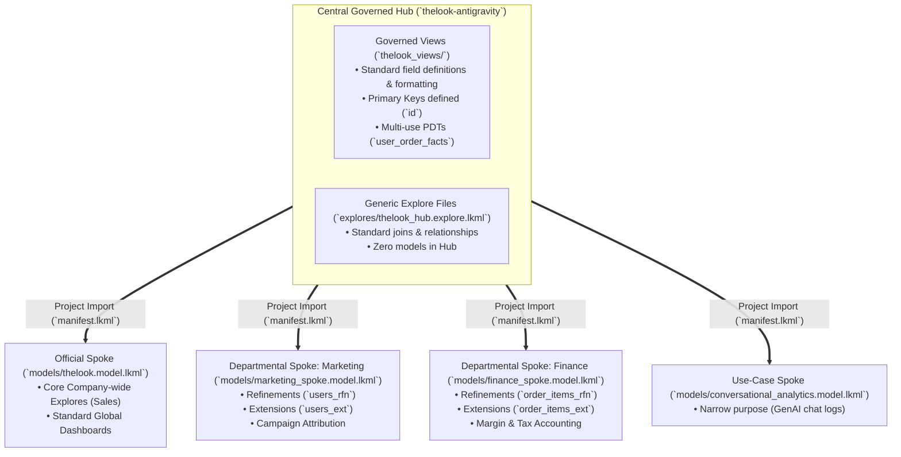

# Looker Hub & Spoke Architecture: Implementation & Demo Guide
*Aligned with the official Google Looker Hub & Spoke Architecture Standard*

---

## 1. Architecture Overview & Spoke Taxonomy

---

## 2. Alignment Matrix: Presentation Slides vs. Implementation

| Presentation Slide | Architectural Principle | Implementation in this Codebase |
| :--- | :--- | :--- |
| **The Central Hub** | **No models in Hub; `.explore.lkml` files** | [`explores/thelook_hub.explore.lkml`](file:///Users/sampitcher/Documents/Projects/thelook-antigravity/explores/thelook_hub.explore.lkml) defines modular explore templates; [`thelook_views/`](file:///Users/sampitcher/Documents/Projects/thelook-antigravity/thelook_views) defines governed views. |
| **Spoke Taxonomy** | **Official, Departmental, and Use-Case Spokes** | • **Official**: [`models/thelook.model.lkml`](file:///Users/sampitcher/Documents/Projects/thelook-antigravity/models/thelook.model.lkml) • **Departmental**: [`models/marketing_spoke.model.lkml`](file:///Users/sampitcher/Documents/Projects/thelook-antigravity/models/marketing_spoke.model.lkml) & [`models/finance_spoke.model.lkml`](file:///Users/sampitcher/Documents/Projects/thelook-antigravity/models/finance_spoke.model.lkml) • **Use-Case**: [`models/conversational_analytics.model.lkml`](file:///Users/sampitcher/Documents/Projects/thelook-antigravity/models/conversational_analytics.model.lkml) |
| **Project Import** | **`manifest.lkml` mechanics** | [`examples/spoke_project_template/manifest.lkml`](file:///Users/sampitcher/Documents/Projects/thelook-antigravity/examples/spoke_project_template/manifest.lkml) demonstrates `remote_dependency` and `local_dependency`. |
| **Refinements vs Extends** | **`_rfn.view.lkml` vs `_ext.view.lkml`** | • Refinements: [`spoke_views/marketing_users_rfn.view.lkml`](file:///Users/sampitcher/Documents/Projects/thelook-antigravity/spoke_views/marketing_users_rfn.view.lkml) • Extensions: [`spoke_views/marketing_users_ext.view.lkml`](file:///Users/sampitcher/Documents/Projects/thelook-antigravity/spoke_views/marketing_users_ext.view.lkml) |
| **Release Management** | **DEV, SIT, UAT, PROD with Deploy Keys** | Hub uses read-write Deploy Key on DEV, read-only on SIT/UAT/PROD. Pull Requests required. |
| **Governance & Security** | **Model Sets, Groups, and Access Grants** | Strict model sets per spoke (`finance_model`, `marketing_model`). Access grant `pii_data` in [`thelook_views/users.view.lkml`](file:///Users/sampitcher/Documents/Projects/thelook-antigravity/thelook_views/users.view.lkml). |
| **BigQuery Compute** | **Dedicated GCP Projects & PDT Datasets** | Fully-qualified BigQuery tables (`sampitcher-playground.the_look_ca.*`) allowing decoupled compute slots per Spoke connection. |

---

## 3. Demo Walkthrough Script

### Step 1: Explain the Hub Design
- Open [`thelook_views/users.view.lkml`](file:///Users/sampitcher/Documents/Projects/thelook-antigravity/thelook_views/users.view.lkml):
  - Point out strict governance: single primary key (`id`), standardized `age` tiers, and clean naming.
- Open [`explores/thelook_hub.explore.lkml`](file:///Users/sampitcher/Documents/Projects/thelook-antigravity/explores/thelook_hub.explore.lkml):
  - Highlight that **no models exist in the Hub itself**. Explores are stored as modular `.explore.lkml` templates so spoke projects can selectively include what they need.

### Step 2: Demonstrate Refinements (`+`) vs. Extends
- Open [`spoke_views/marketing_users_rfn.view.lkml`](file:///Users/sampitcher/Documents/Projects/thelook-antigravity/spoke_views/marketing_users_rfn.view.lkml):
  - **Refinement (`view: +users`)**: Augments the core view in-place for the marketing team without touching central hub code.
- Open [`spoke_views/marketing_users_ext.view.lkml`](file:///Users/sampitcher/Documents/Projects/thelook-antigravity/spoke_views/marketing_users_ext.view.lkml):
  - **Extension (`view: marketing_users_ext { extends: [users] }`)**: Creates an isolated departmental variant (`campaign_cohort`) to prevent namespace collisions.

### Step 3: Demonstrate Departmental & Use-Case Spokes
- Open [`models/marketing_spoke.model.lkml`](file:///Users/sampitcher/Documents/Projects/thelook-antigravity/models/marketing_spoke.model.lkml) & [`models/finance_spoke.model.lkml`](file:///Users/sampitcher/Documents/Projects/thelook-antigravity/models/finance_spoke.model.lkml):
  - Show how each model sets its own caching policy (`datagroup`), custom group labels, and tailored explores.
- Open [`models/conversational_analytics.model.lkml`](file:///Users/sampitcher/Documents/Projects/thelook-antigravity/models/conversational_analytics.model.lkml):
  - Highlight the **Use-Case Spoke** dedicated to GenAI chat telemetry and interaction logs.

### Step 4: Show Cross-Project Import Mechanics
- Open [`examples/spoke_project_template/manifest.lkml`](file:///Users/sampitcher/Documents/Projects/thelook-antigravity/examples/spoke_project_template/manifest.lkml):
  - Show how a separate GitHub repository connects to the Hub via `remote_dependency` with a pinned Git ref/tag.
