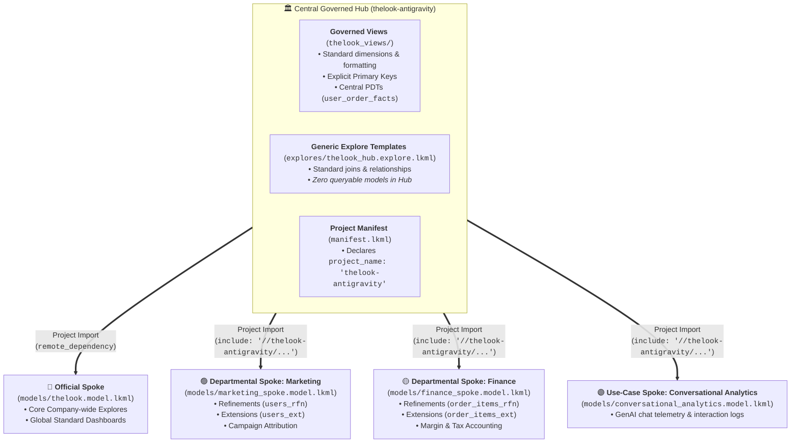
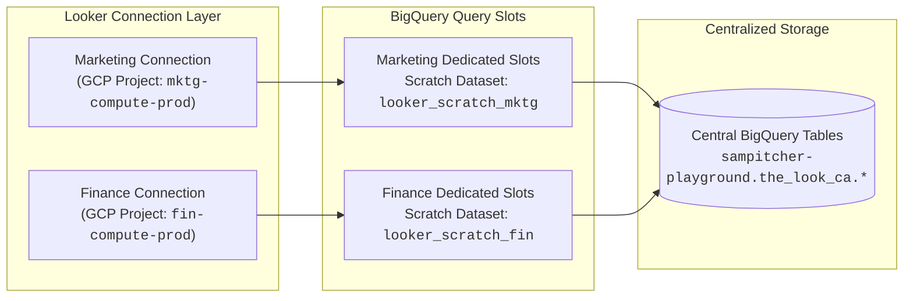

# Looker Hub & Spoke Architecture: Master Presentation & Live Demo Playbook

**Target Audience:** Looker Developers, BI Engineers, Data Leads, and Enterprise Architects.  
**Objective:** Deliver an end-to-end, comprehensive demonstration of Looker's decentralized **Hub & Spoke** architecture—covering LookML design patterns, Spoke taxonomy, user access control / impersonation, CI/CD release engineering, and BigQuery compute isolation.

---

## 1. Architectural Overview & Component Taxonomy



---

## 2. Important Architectural Distinction: Demo Sandbox vs. Multi-Project Production

```
┌──────────────────────────────────────────────────────────────────────────────────────────────────┐
│ PRODUCTION ARCHITECTURE (Multi-Project)                                                         │
│                                                                                                  │
│  [ Central Hub Repo / Project ]       [ Marketing Spoke Repo ]         [ Finance Spoke Repo ]    │
│  • project_name: "looker-hub"         • manifest.lkml                  • manifest.lkml           │
│  • thelook_views/                     • remote_dependency: looker-hub  • remote_dependency       │
│  • explores/thelook_hub.explore.lkml  • include: "//looker-hub/..."    • include: "//looker-hub" │
│  • 🛑 ZERO .model.lkml files          • marketing_spoke.model.lkml     • finance_spoke.model.lkml│
└──────────────────────────────────────────────────────────────────────────────────────────────────┘
                                              ▲
                                              │ (Simulated in this Demo)
                                              ▼
┌──────────────────────────────────────────────────────────────────────────────────────────────────┐
│ DEMO SANDBOX ARCHITECTURE (Single Project: thelook-antigravity)                                  │
│                                                                                                  │
│  All components live in this single project so you can demo everything in one IDE session:       │
│  • Hub Layer: /thelook_views/ & /explores/thelook_hub.explore.lkml                               │
│  • Spoke Models: /models/marketing_spoke.model.lkml & /models/finance_spoke.model.lkml           │
│  • Spoke Customizations: /spoke_views/ (*_rfn.view.lkml & *_ext.view.lkml)                       │
│  • Production Multi-Project Templates: /examples/spoke_project_template/                         │
└──────────────────────────────────────────────────────────────────────────────────────────────────┘
```

> [!NOTE]
> **Why Separate Projects in Production?**
> 1. **Git Isolation**: Marketing developers cannot modify or open pull requests on the Hub or Finance codebases.
> 2. **Independent Deployment Cycles**: Marketing can push and deploy code without waiting for Finance or Central BI release windows.
> 3. **True Hub Purity**: The Hub project has **no `.model.lkml` files**, preventing any uncurated explores from appearing on the instance.
>
> **Why a Single Project for this Demo?**
> Setting up multiple projects in a demo requires managing 4 separate Git repositories, 4 deploy keys, and multiple Looker project setups. Consolidating into this demo project allows you to showcase **every LookML pattern**, **explore template**, **refinement**, **extension**, and **Model Set role filtering** smoothly from a single screen.

---

## 3. Master Demo Script & Presentation Flow

### Phase 1: The Central Governed Hub (The "Single Source of Truth")

> **Key Talking Point:**  
> *"In a true enterprise Hub & Spoke architecture, the central Hub contains universal business logic and is imported as read-only code. Crucially, there are NO model files or queryable explores in the Hub—only modular explore templates and governed views."*

1. **Governed Views**:
   - Open [`thelook_views/users.view.lkml`](file:///Users/sampitcher/Documents/Projects/thelook-antigravity/thelook_views/users.view.lkml).
   - **Show:** Explicit primary key (`dimension: id { primary_key: yes }`), standardized snake_case dimensions (`age`, `full_name`), and central drill fields.
   - **Show Column-Level Security:** Point out `dimension: email { required_access_grants: [pii_data] }`.
2. **Generic Explore Files (`.explore.lkml`)**:
   - Open [`explores/thelook_hub.explore.lkml`](file:///Users/sampitcher/Documents/Projects/thelook-antigravity/explores/thelook_hub.explore.lkml).
   - **Show:** Governed explore templates (`order_items`, `orders`, `users`, `events`) with standardized `many_to_one` joins.
   - **Explain:** Looker does not allow `.model.lkml` files to be imported or extended across projects. By packaging explores into `.explore.lkml` files, Spokes can include only the exact explores they need.

---

### Phase 2: Spoke Customization — Refinements (`+`) vs. Extensions (`extends`)

> **Key Talking Point:**  
> *"Spoke teams need the autonomy to enrich data without breaking central governance. Looker provides two mechanisms: Refinements for in-place modification, and Extensions for isolated departmental variants."*

| Customization Type | Naming Standard | LookML Syntax | Best Used For |
| :--- | :--- | :--- | :--- |
| **Refinement** | `[view]_rfn.view.lkml` | `view: +users { ... }` | Adding department-specific measures or tweaking labels across all explores referencing that view. |
| **Extension** | `[view]_ext.view.lkml` | `view: users_ext { extends: [users] }` | Creating dedicated departmental variants (e.g., custom cohort views) to avoid naming collisions. |

1. **Refinement in Action**:
   - Open [`spoke_views/marketing_users_rfn.view.lkml`](file:///Users/sampitcher/Documents/Projects/thelook-antigravity/spoke_views/marketing_users_rfn.view.lkml).
   - Show how Marketing injects `marketing_channel_group`, `organic_user_count`, and `paid_user_count` into `users` without editing Hub files.
2. **Extension in Action**:
   - Open [`spoke_views/marketing_users_ext.view.lkml`](file:///Users/sampitcher/Documents/Projects/thelook-antigravity/spoke_views/marketing_users_ext.view.lkml).
   - Show `view: marketing_users_ext { extends: [users] }` with `campaign_cohort` dimensions, cleanly isolated from the base view.
3. **Finance Spoke Logic**:
   - Open [`spoke_views/finance_order_items_rfn.view.lkml`](file:///Users/sampitcher/Documents/Projects/thelook-antigravity/spoke_views/finance_order_items_rfn.view.lkml) & [`spoke_views/finance_order_items_ext.view.lkml`](file:///Users/sampitcher/Documents/Projects/thelook-antigravity/spoke_views/finance_order_items_ext.view.lkml).
   - Show financial tax liability (`estimated_tax`), net margin calculations (`total_net_revenue`), and high-value audit extensions.

---

### Phase 3: The 3 Spoke Archetypes (Official, Departmental, Use-Case)

1. **Official Spoke (Company-Wide Core Sales)**:
   - Open [`models/thelook.model.lkml`](file:///Users/sampitcher/Documents/Projects/thelook-antigravity/models/thelook.model.lkml).
   - Reusable baseline model used across the entire organization.
2. **Departmental Spokes**:
   - Open [`models/marketing_spoke.model.lkml`](file:///Users/sampitcher/Documents/Projects/thelook-antigravity/models/marketing_spoke.model.lkml) & [`models/finance_spoke.model.lkml`](file:///Users/sampitcher/Documents/Projects/thelook-antigravity/models/finance_spoke.model.lkml).
   - Show departmental caching datagroups (`marketing_daily_datagroup`, `finance_eod_datagroup`), refined explore labels, and custom group labels (`group_label: "Marketing Spoke"`).
3. **Use-Case Spoke (Single-Purpose Application)**:
   - Open [`models/conversational_analytics.model.lkml`](file:///Users/sampitcher/Documents/Projects/thelook-antigravity/models/conversational_analytics.model.lkml).
   - Dedicated exclusively to GenAI chat telemetry and interaction logs.

---

### Phase 4: Standalone Cross-Project Import Mechanics (`manifest.lkml`)

> **Key Talking Point:**  
> *"When a spoke lives in a separate Git repository, it imports the Hub using Looker's Project Import feature."*

1. **Manifest Configuration**:
   - Open [`examples/spoke_project_template/manifest.lkml`](file:///Users/sampitcher/Documents/Projects/thelook-antigravity/examples/spoke_project_template/manifest.lkml).
   ```lookml
   project_name: "marketing_spoke"

   remote_dependency: thelook-antigravity {
     url: "git@github.com:sam-pitcher/thelook-antigravity.git"
     ref: "master" # Or pinned release tag (e.g., 'v1.0.0')
   }
   ```
2. **Import Include Syntax**:
   - Open [`examples/spoke_project_template/models/marketing_spoke.model.lkml`](file:///Users/sampitcher/Documents/Projects/thelook-antigravity/examples/spoke_project_template/models/marketing_spoke.model.lkml).
   - Explain the double forward slash syntax: `include: "//thelook-antigravity/explores/thelook_hub.explore.lkml"`.

---

## 3. Live Security & User Impersonation Demo (Step-by-Step Setup)

To show how the Looker UI dynamically adapts based on user department access, configure the following in Looker Admin.

### Step 1: Configure Model Sets (Admin &rarr; Model Sets)

| Model Set Name | Included Models | Description |
| :--- | :--- | :--- |
| `official_model_set` | `thelook` | Access to core global explores only. |
| `marketing_model_set` | `thelook`, `marketing_spoke` | Access to core explores + Marketing departmental explores. |
| `finance_model_set` | `thelook`, `finance_spoke` | Access to core explores + Finance departmental explores. |
| `analytics_model_set` | `conversational_analytics` | Access exclusively to GenAI chat telemetry. |
| `all_access_model_set` | `All Models` | Central BI & Looker Admin access. |

---

### Step 2: Configure Roles (Admin &rarr; Roles)

| Role Name | Permission Set | Model Set | Assigned User Group |
| :--- | :--- | :--- | :--- |
| `Marketing Analyst` | `Explore` (or `User`) | `marketing_model_set` | `Marketing Team` |
| `Finance Auditor` | `Explore` (or `User`) | `finance_model_set` | `Finance Team` |
| `AI Operations Specialist`| `Explore` (or `User`) | `analytics_model_set` | `GenAI Team` |

---

### Step 3: Configure User Attributes for Column-Level Security (Admin &rarr; User Attributes)

1. Create User Attribute: **`can_see_pii`**
   - **Type**: String / YesNo
   - **Default Value**: `No`
   - **Group Override**: Set `Yes` for `Finance Team` / `Executive Group`.
2. Connects directly to LookML:
   ```lookml
   access_grant: pii_data {
     user_attribute: can_see_pii
     allowed_values: ["Yes", "yes", "true"]
   }
   ```

---

### Step 4: Perform the Live Sudo (Impersonation) Demo

1. **Log in as Looker Admin**:
   - Navigate to the **Explore** menu.
   - **Observation:** All explore groups are visible: *Order Items*, *Marketing Spoke*, *Finance Spoke*, and *Conversational Analytics*.
2. **Sudo as "Marketing Analyst"** (Admin &rarr; Users &rarr; Sudo):
   - Navigate to the **Explore** menu.
   - **Observation:** 
     - ✅ *Order Items (Core Sales)* and *Marketing Spoke* are visible.
     - ❌ *Finance Spoke* and *Conversational Analytics* are completely hidden.
3. **Sudo as "Finance Auditor"**:
   - Navigate to the **Explore** menu.
   - **Observation:** 
     - ✅ *Order Items (Core Sales)* and *Finance Spoke* are visible.
     - ❌ *Marketing Spoke* is hidden.
     - Open the *Users* view &rarr; The `email` column is visible because `can_see_pii = Yes`.
4. **Sudo as "Standard User (`can_see_pii = No`)"**:
   - Open *Users* view &rarr; `email` field is completely stripped from the field picker and SQL queries.

---

## 4. Enterprise Operations: CI/CD, Content Migration & BigQuery Isolation

### Multi-Instance Release Management Framework

```
[ DEV Instance ] ──────► [ SIT Instance ] ──────► [ UAT Instance ] ──────► [ PROD Instance ]
  • Dev Mode (Local)       • Advanced Deploy        • User Acceptance        • End-User Live
  • Read/Write Deploy Key  • Read-Only Key          • Read-Only Key          • Read-Only Key
  • PR Required (GitHub)   • Tag & Deploy           • Validation             • Advanced Deploy
```

1. **Deploy Keys**:
   - Central Hub: Requires 4 deploy keys (DEV read/write; SIT, UAT, PROD read-only).
   - Spokes: Require 2 deploy keys (DEV read/write; PROD read-only).
2. **Spoke Synchronization**:
   - When a new version of the Hub is tagged and merged, Spoke developers click **"Update Dependencies"** in their Looker IDE to pull the latest tagged Hub release into their development branches.

---

### Decentralized BigQuery Compute Slots



- **Fully-Qualified Table IDs**: All LookML views reference `sampitcher-playground.the_look_ca.table_name`.
- **Decoupled Billing & Compute**: Each Spoke connection executes in its own GCP project, ensuring that heavy marketing dashboard queries never exhaust BigQuery slots or query rate limits for Finance reporting.

---

### Content Migration & Stable Slugs

- **LookML Dashboards**: Version-controlled in Git, migrated across environments during code release cycles.
- **User-Defined Dashboards (UDDs)**: Migrated via open-source tools (**Gazer** / **Looker-Deployer**) preserving the 22-character unique slug (e.g., `slug: 8K1vL9x2Qwe`) across DEV &rarr; SIT &rarr; PROD so cross-dashboard links and schedules never break.

---

## 5. Summary Cheat Sheet for Presenters

| Question from Audience | Presenter Answer |
| :--- | :--- |
| *"Why not define explores in the Hub model?"* | Looker models cannot be imported across projects. Generic `.explore.lkml` files decouple explore topology from models, enabling clean project imports. |
| *"When should we use Extends vs. Refinements?"* | Use **Refinements (`_rfn`)** to apply universal customizations in-place; use **Extends (`_ext`)** when creating new departmental variations to prevent field collision. |
| *"How do we stop spoke developers from altering central Hub logic?"* | Enforce **"Require merge requests"** on the Hub Git repository. Only central data architects possess merge permissions on GitHub. |
| *"How do we prevent one department's queries from slowing down another?"* | Configure separate Looker connections with dedicated GCP query/compute projects and isolated PDT scratch datasets. |
