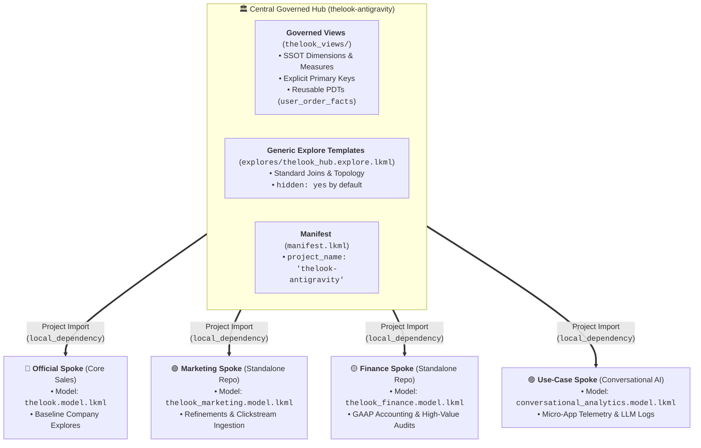
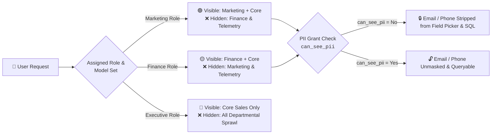
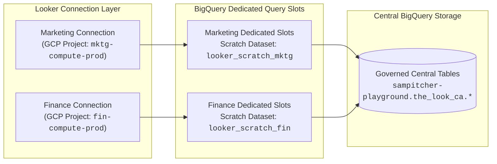

# 🏛️ Looker Hub & Spoke Architecture: Executive Presentation Deck

> **Target Audience:** Looker Developers, BI Engineers, Data Leads, FinOps & Enterprise Architects  
> **Instance Base URL:** `https://915eab0a-ce5e-423b-81fb-1e93c2f3424d.looker.app`  
> **Repository Format:** 7-Slide Ready Google Slides Master Structure

---

## 📑 Slide Deck Outline (7 Slides)

1. [**Slide 1:** Executive Vision — Decentralized Velocity with Central Governance](#slide-1-executive-vision--decentralized-velocity-with-central-governance)
2. [**Slide 2:** Architecture Topology — Multi-Project Git & LookML Anatomy](#slide-2-architecture-topology--multi-project-git--lookml-anatomy)
3. [**Slide 3:** Departmental Autonomy — Refinements, Extensions & Custom Ingestion](#slide-3-departmental-autonomy--refinements-extensions--custom-ingestion)
4. [**Slide 4:** Enterprise Security & Dynamic RBAC — Model Sets & PII Access Grants](#slide-4-enterprise-security--dynamic-rbac--model-sets--pii-access-grants)
5. [**Slide 5:** Live Demonstration Playbook — The Sudo Sequence](#slide-5-live-demonstration-playbook--the-sudo-sequence)
6. [**Slide 6:** FinOps & Scaled Operations — BigQuery Isolation & Multi-Stage CI/CD](#slide-6-finops--scaled-operations--bigquery-isolation--multi-stage-cicd)
7. [**Slide 7:** Executive Defense & Architectural Q&A](#slide-7-executive-defense--architectural-qa)

---

# Slide 1: Executive Vision — Decentralized Velocity with Central Governance

### 🎯 Slide Goal
Establish the core enterprise dilemma (Centralized Bottleneck vs. Decentralized Chaos) and introduce Google's official Looker Hub & Spoke architecture as the solution.

### 📊 Visual Layout / Content

```
   TRADITIONAL BOTTLENECK                     METRIC ANARCHY                    THE LOOKER HUB & SPOKE
┌──────────────────────────┐          ┌──────────────────────────┐          ┌──────────────────────────┐
│  Central BI Bottleneck   │          │ Decentralized Wild West  │          │   Federated Governance   │
├──────────────────────────┤          ├──────────────────────────┤          ├──────────────────────────┤
│ • 3-week Jira backlogs   │          │ • Metric definition drift│          │ • Centralized SSOT logic │
│ • Slow departmental dev  │    VS    │ • Duplicate ETL pipelines│    VS    │ • Departmental velocity  │
│ • Bloated single models  │          │ • Compliance & PII leaks │          │ • Zero cross-talk drift  │
│ • Single point of failure│          │ • BigQuery slot starvation│         │ • Compute slot isolation │
└──────────────────────────┘          └──────────────────────────┘          └──────────────────────────┘
```

### 💡 Slide Bullets & Talking Points
* **The Problem:** Enterprise data teams face an impossible tradeoff: centralize everything and become a development bottleneck, or give departments free rein and suffer metric drift and compliance violations.
* **The Solution:** Hub & Spoke separates **Universal Truth (Hub)** from **Departmental Innovation (Spokes)**.
* **The Golden Rule:** The Central Hub maintains single-source-of-truth business logic and access control; Departmental Spokes import the Hub to build specialized explores, metrics, and models autonomously.

### 🎭 Multi-Persona Value Proposition
| Stakeholder | Core Problem Solved | Tangible Business Benefit |
| :--- | :--- | :--- |
| **Data Architect** | Metric drift & broken production queries | Hub is read-only for spokes; universal definitions cannot be mutated. |
| **Department Analyst** | Weeks waiting for central BI sprint cycles | Autonomy to add metrics, refine views, and release immediately. |
| **Chief Compliance Officer**| PII leaks across departmental reports | PII Access Grants in the Hub automatically apply across all Spokes. |
| **Cloud DBA / FinOps** | Runaway dashboard queries exhausting compute | Dedicated BigQuery connections & scratch schemas isolate slot usage. |

---

# Slide 2: Architecture Topology — Multi-Project Git & LookML Anatomy

### 🎯 Slide Goal
Diagram how Looker multi-project imports (`local_dependency`) connect the Central Hub to Departmental and Use-Case Spokes.

### 📊 Visual Architecture Diagram



### 💡 Slide Bullets & Talking Points
1. **Generic Explores in Hub:** Explores are declared in `.explore.lkml` files with `hidden: yes` by default. They act as pure topology templates that spokes can import and selectively unhide.
2. **Decoupled Repositories:** Each spoke lives in its own Git repository (`thelook-marketing-spoke`, `thelook-finance-spoke`) with independent branch protection and CI/CD.
3. **Local Dependency:** Spokes declare `local_dependency: { project: "thelook-antigravity" }` in `manifest.lkml` and import views via `//thelook-antigravity/thelook_views/**/*.view.lkml`.

---

# Slide 3: Departmental Autonomy — Refinements, Extensions & Custom Ingestion

### 🎯 Slide Goal
Demonstrate the 3 ways Spoke developers customize data without mutating the upstream Hub repository.

### 📊 Visual Code Anatomy

```
   1. REFINEMENTS (+view)              2. EXTENSIONS (extends)            3. SPOKE-EXCLUSIVE INGESTION
┌─────────────────────────────┐     ┌─────────────────────────────┐     ┌─────────────────────────────┐
│ • In-place modification     │     │ • Creates a distinct copy   │     │ • Ingest raw bespoke data   │
│ • Universal for that Spoke  │     │ • No field collision        │     │ • Join to central Hub views │
│ • Keeps same view name      │     │ • Specialized audit view    │     │ • Insulates Hub & peers     │
└─────────────────────────────┘     └─────────────────────────────┘     └─────────────────────────────┘
```

### 💡 Code Snippets & Talking Points

```lookml
# 1. REFINEMENT PATTERN (thelook-marketing-spoke/views/users_rfn.view.lkml)
view: +users {
  dimension: marketing_channel_group {
    type: string
    sql: CASE 
           WHEN ${traffic_source} = 'Search' THEN 'Search Engine'
           WHEN ${traffic_source} IN ('Facebook', 'Display') THEN 'Paid Social/Ads'
           ELSE 'Direct / Organic' 
         END ;;
  }
}

# 2. EXTENSION PATTERN (thelook-finance-spoke/views/order_items_ext.view.lkml)
view: order_items_ext {
  extends: [order_items]
  dimension: audit_risk_tier {
    type: string
    sql: CASE WHEN ${sale_price} > 500 THEN 'HIGH_RISK_AUDIT' ELSE 'STANDARD' END ;;
  }
}

# 3. SPOKE-EXCLUSIVE INGESTION (thelook-marketing-spoke/views/events.view.lkml)
# Raw clickstream table ingested directly by Marketing without polluting the Hub:
explore: events {
  label: "Marketing: Web Traffic & Event Clickstream"
  group_label: "Marketing Spoke"
  join: users {
    type: left_outer
    relationship: many_to_one
    sql_on: ${users.id} = ${events.user_id} ;; # Joined to Governed Hub View!
  }
}
```

---

# Slide 4: Enterprise Security & Dynamic RBAC — Model Sets & PII Access Grants

### 🎯 Slide Goal
Show how Looker enforces multi-tenant security: Dynamic Explore menu filtering via **Model Sets** and Column-Level Security (CLS) via **PII Access Grants**.

### 📊 Persona & Security Matrix



### 📋 Configured Persona Directory
| Persona / Role | Looker Role ID | Assigned Model Set | `can_see_pii` | Menu Experience |
| :--- | :---: | :--- | :---: | :--- |
| **Marketing Analyst** | `48` | `marketing_model_set` (ID 36) | `No` | Marketing Explores only; PII columns completely hidden. |
| **Finance Auditor** | `49` | `finance_model_set` (ID 37) | `Yes` | Finance Accounting & Audits only; PII unmasked. |
| **Executive Leader** | `50` | `official_model_set` (ID 38) | `No` | Clean company-wide Sales KPIs; zero departmental clutter. |
| **Super Admin** | `2` | `All Models` (ID 1) | `Yes` | Unrestricted global access across all Spokes. |

---

# Slide 5: Live Demonstration Playbook — The Sudo Sequence

### 🎯 Slide Goal
Provide a foolproof, live step-by-step presentation script using `scripts/set_persona.py` and Looker UI Sudoing.

### 🎬 Live Demo Script

```
                               ┌─────────────────────────────────┐
                               │   python3 scripts/set_persona   │
                               └────────────────┬────────────────┘
                                                │
                 ┌──────────────────────────────┼──────────────────────────────┐
                 ▼                              ▼                              ▼
            [marketing]                     [finance]                     [executive]
         Role 48 (Marketing)             Role 49 (Finance)             Role 50 (Executive)
         `can_see_pii = No`             `can_see_pii = Yes`            `can_see_pii = No`
```

#### **Step 1: Start as Super Admin (Show Full Universe)**
1. Open [**Looker Explores**](https://915eab0a-ce5e-423b-81fb-1e93c2f3424d.looker.app/browse).
2. **Talking Point:** *"As Admin, we see every model and explore. Now let's see how regular departmental analysts experience the platform."*

#### **Step 2: Demo Marketing Persona (Autonomy + PII Masking)**
1. Run in terminal: `python3 scripts/set_persona.py marketing`
2. Go to [**Admin &rarr; Users**](https://915eab0a-ce5e-423b-81fb-1e93c2f3424d.looker.app/admin/users) &rarr; Sudo as **`shredr looker`** (ID `3`).
3. Click **Explore**:
   - ✅ **Show:** `Thelook Marketing` explores are visible (`Campaign Attribution`, `Web Traffic & Events`).
   - ❌ **Show:** `Finance` and `Conversational Analytics` are **completely hidden**.
   - 🔒 **Show:** In `Customer Acquisition`, `Email` is **hidden** (`can_see_pii = No`).

#### **Step 3: Demo Finance Persona (Auditing + PII Access)**
1. Click **Stop Sudoing** &rarr; Run in terminal: `python3 scripts/set_persona.py finance`
2. Sudo as **`shredr looker`** &rarr; Click **Explore**:
   - ❌ **Show:** `Marketing` is completely hidden.
   - ✅ **Show:** `Finance: Revenue & Tax Accounting` and `High-Value Audits` are visible.
   - 🔓 **Show:** In `Revenue & Tax`, `Email` is **unmasked and visible** (`can_see_pii = Yes`).

#### **Step 4: Demo Executive Persona (Zero Clutter)**
1. Click **Stop Sudoing** &rarr; Run in terminal: `python3 scripts/set_persona.py executive`
2. Sudo as **`shredr looker`** &rarr; Click **Explore**:
   - 🌟 **Show:** Only clean, official **`Order Items`** appears. Zero departmental noise.

---

# Slide 6: FinOps & Scaled Operations — BigQuery Isolation & Multi-Stage CI/CD

### 🎯 Slide Goal
Explain how the Hub & Spoke architecture protects cloud infrastructure budgets (BigQuery Slots) and scales across multi-instance release tiers.

### 📊 BigQuery Compute & Storage Topology



### 💡 Key Operational Takeaways
1. **FinOps Isolation:** Each Spoke model can point to its own Looker Connection mapped to a departmental GCP project. Heavy marketing ad-hoc queries will **never exhaust compute slots** needed by critical Finance month-end reporting.
2. **Multi-Stage CI/CD Pipeline:**
   ```
   [ DEV Instance ] ──────► [ SIT Instance ] ──────► [ UAT Instance ] ──────► [ PROD Instance ]
     • Read/Write Deploy Key  • Read-Only Key          • Read-Only Key          • Read-Only Key
     • Feature Branching      • Automated Tagging      • User Acceptance Testing• Advanced Deploy
   ```
3. **Content Migration & Stable Slugs:** User-Defined Dashboards (UDDs) migrate seamlessly across instances using **Gazer / Looker-Deployer**, preserving dashboard slugs (`slug: 8K1vL9x2Qwe`) so cross-spoke links never break.

---

# Slide 7: Executive Defense & Architectural Q&A

### 🎯 Slide Goal
Equip the presenter with crisp, authoritative answers to the toughest architecture questions.

### 🛡️ Presenter Defense Matrix

| Question from Audience | Best Practice Answer |
| :--- | :--- |
| **"Can a Spoke developer break or alter central definitions?"** | **No.** Looker project imports are strictly read-only. Spokes can refine or extend views for their own model, but cannot push changes upstream to the Hub repository. |
| **"Why define Explores in `.explore.lkml` instead of `.model.lkml`?"** | Looker models cannot be imported across projects. Generic `.explore.lkml` files decouple explore join topology from models, enabling clean reuse across Hub and Spokes. |
| **"Why set `hidden: yes` on Hub explores by default?"** | To prevent explore menu pollution. Setting `hidden: yes` in the Hub ensures that importing the Hub doesn't expose unwanted explores; Spokes explicitly unhide (`hidden: no`) only what they need. |
| **"How do we prevent Spoke PDTs from interfering with each other?"** | Spokes define dedicated scratch datasets (`looker_scratch_mktg`, `looker_scratch_fin`) and custom datagroups, ensuring derived table builds run on isolated compute schedules. |

---

## 🔗 Direct Live Links Reference Table

| Explore Asset | Direct Looker URL |
| :--- | :--- |
| **Core Sales (Official Spoke)** | [Open Explore](https://915eab0a-ce5e-423b-81fb-1e93c2f3424d.looker.app/explore/thelook/order_items) |
| **Marketing: Web Traffic & Events** | [Open Explore](https://915eab0a-ce5e-423b-81fb-1e93c2f3424d.looker.app/explore/thelook_marketing/events) |
| **Marketing: Cohort Analysis** | [Open Explore](https://915eab0a-ce5e-423b-81fb-1e93c2f3424d.looker.app/explore/thelook_marketing/marketing_campaign_cohorts) |
| **Marketing: Attribution & Orders** | [Open Explore](https://915eab0a-ce5e-423b-81fb-1e93c2f3424d.looker.app/explore/thelook_marketing/order_items) |
| **Marketing: Customer Audiences** | [Open Explore](https://915eab0a-ce5e-423b-81fb-1e93c2f3424d.looker.app/explore/thelook_marketing/users) |
| **Finance: High-Value Audits** | [Open Explore](https://915eab0a-ce5e-423b-81fb-1e93c2f3424d.looker.app/explore/thelook_finance/finance_high_value_audits) |
| **Finance: Revenue & Tax** | [Open Explore](https://915eab0a-ce5e-423b-81fb-1e93c2f3424d.looker.app/explore/thelook_finance/order_items) |
| **Finance: Order Audit Trail** | [Open Explore](https://915eab0a-ce5e-423b-81fb-1e93c2f3424d.looker.app/explore/thelook_finance/orders) |
| **GenAI Chat Telemetry** | [Open Explore](https://915eab0a-ce5e-423b-81fb-1e93c2f3424d.looker.app/explore/conversational_analytics/interaction_logs) |
