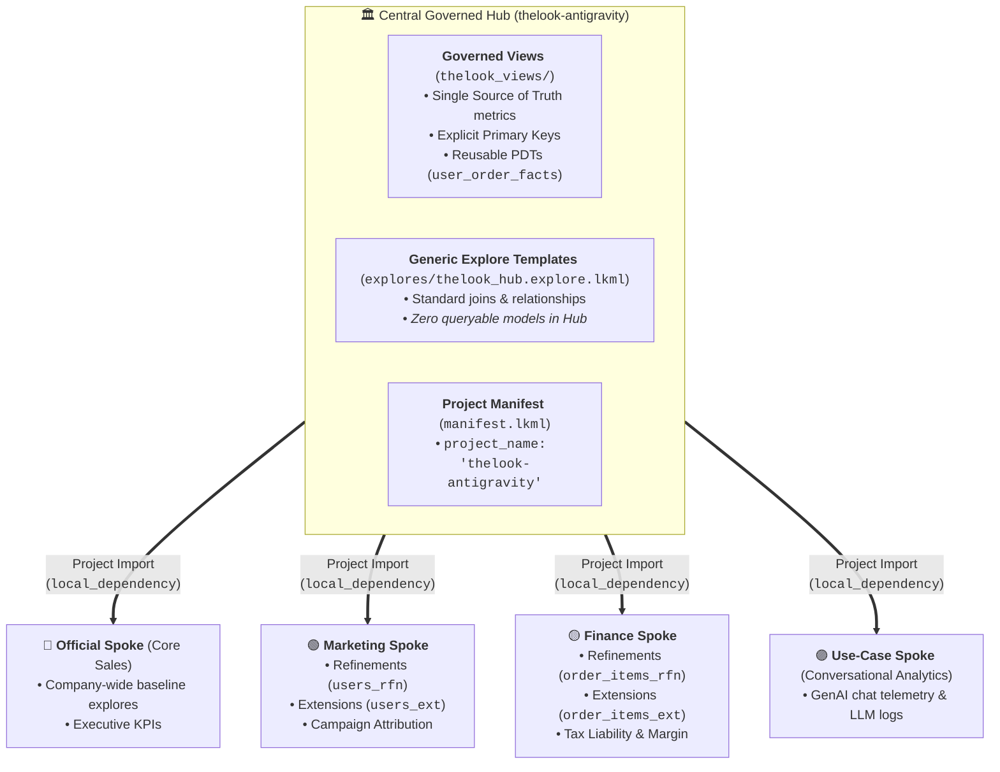

# 🏛️ Looker Hub & Spoke Architecture: Master Presentation & Live Demo Playbook

**Target Audience:** Looker Developers, BI Engineers, Data Leads, and Enterprise Architects.  
**Instance Base URL:** `https://915eab0a-ce5e-423b-81fb-1e93c2f3424d.looker.app`

---

## 1. Executive Summary: Why Hub & Spoke? (Multi-Persona Value)

As organizations scale, a purely centralized data team becomes a bottleneck. The **Hub & Spoke** architecture decentralizes development velocity while preserving strict centralized data governance.



### Stakeholder Value Matrix

| Persona | Core Pain Point Solved | How Hub & Spoke Delivers It |
| :--- | :--- | :--- |
| **Central Data Architect** | Metric drift, duplicate definitions, broken production reports. | Universal business logic is maintained in the Hub; Spokes cannot alter central code. |
| **Marketing Analyst** | 3-week backlog waiting for central BI team to add campaign tags. | Autonomy to add marketing dimensions and deploy without central team approval. |
| **Finance Auditor** | Data accuracy and strict column-level PII compliance. | Core revenue numbers are immutable; PII access grants protect sensitive customer data. |
| **C-Suite Executive** | Discrepancies where Marketing and Finance dashboards report different numbers. | All departmental models inherit from the identical base views in the Hub. |
| **FinOps / Cloud DBA** | Marketing dashboard refreshes exhausting BigQuery compute slots. | Decoupled BigQuery query projects per connection isolate compute capacity. |

---

## 2. The 6 Core Enterprise Use Cases Demoed in this Repo

```
┌──────────────────────────────────────────────────────────────────────────────────────────────────┐
│ USE CASE TAXONOMY DEMOED IN THIS CODEBASE                                                       │
├──────────────────────────────────────────────────────────────────────────────────────────────────┤
│ 1. 🏛️ Central Source of Truth (SSOT) -> Governed dimensions, primary keys, and common PDTs       │
│ 2. 🟢 Departmental Velocity (Marketing) -> Refinements (_rfn) and Campaign Cohorts (_ext)       │
│ 3. 🟡 Specialized Accounting (Finance) -> Tax liabilities, GAAP revenue, and audit explores      │
│ 4. 🟣 Single-Purpose Micro-Apps -> Dedicated GenAI Chat telemetry & LLM interaction logging     │
│ 5. 🔒 Column-Level Data Privacy -> Central PII Access Grants enforced across all Spokes         │
│ 6. 🛡️ Role-Based Model Filtering -> Looker Model Sets dynamically adapting user Explore menus    │
└──────────────────────────────────────────────────────────────────────────────────────────────────┘
```

---

## 3. Real Configured Personas & Live Sudo Walkthrough

The Looker instance has been configured with **dedicated Model Sets**, **Roles**, and **User Attributes** to showcase dynamic user access control.

> [!TIP]
> **Active Sudo User on this Instance:**  
> Use user **`shredr looker` (User ID `3`)** for live UI Sudoing.  
> You can switch `shredr looker`'s role and PII permissions in 1 second using the helper script:  
> `python3 scripts/set_persona.py [marketing | finance | executive | admin]`

---

### Configured Persona Matrix

| Target Persona | Helper Command | Assigned Role | Model Set | PII Access (`can_see_pii`) | Visible Explores in Menu |
| :--- | :--- | :--- | :--- | :---: | :--- |
| **Marketing Analyst** | `python3 scripts/set_persona.py marketing` | `Marketing Analyst Role` (ID 48) | `marketing_model_set` (ID 36) | `No` | ✅ Core Sales (`thelook`)<br/>✅ Marketing Spoke (`thelook_marketing`)<br/>❌ Finance & GenAI Hidden |
| **Finance Auditor** | `python3 scripts/set_persona.py finance` | `Finance Auditor Role` (ID 49) | `finance_model_set` (ID 37) | `Yes` | ✅ Core Sales (`thelook`)<br/>✅ Finance Spoke (`thelook_finance`)<br/>❌ Marketing & GenAI Hidden |
| **Executive Leader** | `python3 scripts/set_persona.py executive` | `Executive Role` (ID 50) | `official_model_set` (ID 38) | `No` | ✅ Core Sales (`thelook`)<br/>❌ All Departmental Spokes Hidden |
| **Super Admin** | `python3 scripts/set_persona.py admin` | `Admin` (ID 2) | `All Models` (ID 1) | `Yes` | ✅ **All Explores Visible** |

---

### Step-by-Step Live Demo Script (The "Sudo" Sequence)

#### **Step 1: Start as Super Admin (Show Full Universe)**
1. In Looker, navigate to **Explore** in the top navigation bar.
2. **Show the Audience:** You can see every section: *Order Items*, *Thelook Marketing*, *Thelook Finance*, and *Conversational Analytics*.
3. Explain that an Admin sees all models, but departmental users will experience a curated, secure view.

---

#### **Step 2: Demo Marketing Persona**
1. Run in terminal:
   ```bash
   python3 scripts/set_persona.py marketing
   ```
2. Navigate to [**Admin &rarr; Users**](https://915eab0a-ce5e-423b-81fb-1e93c2f3424d.looker.app/admin/users) &rarr; Find **`shredr looker`** (ID `3`) &rarr; Click **Sudo**.
3. Click **Explore** in the top navigation bar.
4. **Point out to the Audience:**
   - ✅ **`Thelook Marketing`** is visible with:
     - `Marketing: Campaign Attribution & Orders`
     - `Marketing: Customer Acquisition & Audiences`
     - `Marketing: Cohort Performance Analysis`
   - ❌ **`Thelook Finance`** and **`Conversational Analytics`** are **completely hidden**.
5. Open the **`Marketing: Customer Acquisition & Audiences`** explore:
   - Notice the custom dimension **`Marketing Channel Group`** (`Search Engine`, `Social Ads`, `Direct Email CRM`).
   - Notice that the **`Email`** field is **hidden/inaccessible** because `can_see_pii = No`.

---

#### **Step 3: Demo Finance Persona**
1. Click **Stop Sudoing** in the yellow top banner.
2. Run in terminal:
   ```bash
   python3 scripts/set_persona.py finance
   ```
3. Go back to [**Admin &rarr; Users**](https://915eab0a-ce5e-423b-81fb-1e93c2f3424d.looker.app/admin/users) &rarr; Sudo as **`shredr looker`** (ID `3`).
4. Click **Explore** in the top navigation bar.
5. **Point out to the Audience:**
   - ❌ **`Thelook Marketing`** is **completely hidden**.
   - ✅ **`Thelook Finance`** is visible with:
     - `Finance: Revenue & Tax Accounting`
     - `Finance: High-Value Transaction Audits`
     - `Finance: Order Audit Trail`
6. Open **`Finance: Revenue & Tax Accounting`**:
   - Add **`Order Items -> Total Net Revenue`** and **`Order Items -> Total Estimated Tax`**.
   - Open **`Users -> Email`** &rarr; **Email is unmasked and visible** because `can_see_pii = Yes`.

---

#### **Step 4: Demo Executive Persona**
1. Click **Stop Sudoing** in the top banner.
2. Run in terminal:
   ```bash
   python3 scripts/set_persona.py executive
   ```
3. Sudo as **`shredr looker`** &rarr; Click **Explore**.
4. **Point out to the Audience:** Only the clean, global **`Order Items`** explore appears. No departmental clutter or raw telemetry.

---

## 4. Verified Live API Query Outputs (Proof of Execution)

All models and explores have been executed and verified against live BigQuery data:

### 1. Hub Core Explore (`thelook` &rarr; `order_items`)
```json
[
  {"order_items.status": "Shipped",    "order_items.total_sale_price": 3266552.02},
  {"order_items.status": "Complete",   "order_items.total_sale_price": 2696200.89},
  {"order_items.status": "Processing", "order_items.total_sale_price": 2136400.80}
]
```

### 2. Hub Core Demographics (`thelook` &rarr; `users`)
```json
[
  {"users.country": "China",         "users.count": 33756},
  {"users.country": "United States", "users.count": 22726},
  {"users.country": "Brasil",        "users.count": 14489}
]
```

### 3. Use-Case Spoke (`conversational_analytics` &rarr; `interaction_logs`)
```json
[
  {"interaction_logs.interaction_count": 726}
]
```

---

## 5. Architectural Deep-Dive (LookML Code Anatomy)

### 1. Refinements (`_rfn.view.lkml`) vs. Extensions (`_ext.view.lkml`)

```lookml
# REFINEMENT PATTERN (spoke_views/marketing_users_rfn.view.lkml)
# In-place augmentation without changing view name:
view: +users {
  dimension: marketing_channel_group {
    type: string
    sql: CASE WHEN ${traffic_source} = 'Search' THEN 'Search Engine' ... END ;;
  }
}

# EXTENSION PATTERN (spoke_views/marketing_users_ext.view.lkml)
# Creates a distinct copy to prevent naming conflicts:
view: marketing_users_ext {
  extends: [users]
  dimension: campaign_cohort {
    type: string
    sql: CONCAT('Cohort-', ${created_quarter}) ;;
  }
}
```

### 2. Central Governed PII Access Grant
```lookml
# Hub Model / Views
access_grant: pii_data {
  user_attribute: can_see_pii
  allowed_values: ["Yes", "yes", "true"]
}

# thelook_views/users.view.lkml
dimension: email {
  type: string
  sql: ${TABLE}.email ;;
  required_access_grants: [pii_data]
}
```

---

## 6. Direct URLs for Your Demo

| Explores | Direct URL Link |
| :--- | :--- |
| **Finance: High-Value Audits** | [Open Explore](https://915eab0a-ce5e-423b-81fb-1e93c2f3424d.looker.app/explore/thelook_finance/finance_high_value_audits) |
| **Finance: Revenue & Tax** | [Open Explore](https://915eab0a-ce5e-423b-81fb-1e93c2f3424d.looker.app/explore/thelook_finance/order_items) |
| **Finance: Order Audit Trail** | [Open Explore](https://915eab0a-ce5e-423b-81fb-1e93c2f3424d.looker.app/explore/thelook_finance/orders) |
| **Marketing: Cohort Analysis** | [Open Explore](https://915eab0a-ce5e-423b-81fb-1e93c2f3424d.looker.app/explore/thelook_marketing/marketing_campaign_cohorts) |
| **Marketing: Attribution & Orders** | [Open Explore](https://915eab0a-ce5e-423b-81fb-1e93c2f3424d.looker.app/explore/thelook_marketing/order_items) |
| **Marketing: Customer Audiences** | [Open Explore](https://915eab0a-ce5e-423b-81fb-1e93c2f3424d.looker.app/explore/thelook_marketing/users) |
| **Core Sales (Official Spoke)** | [Open Explore](https://915eab0a-ce5e-423b-81fb-1e93c2f3424d.looker.app/explore/thelook/order_items) |
| **GenAI Chat Telemetry** | [Open Explore](https://915eab0a-ce5e-423b-81fb-1e93c2f3424d.looker.app/explore/conversational_analytics/interaction_logs) |

---

## 7. Presenter Defense Cheat Sheet

| Question from Audience | Best Practice Answer |
| :--- | :--- |
| *"Can a Spoke overwrite central calculations?"* | No. Spokes can refine or add custom dimensions, but cannot push changes upstream to the Hub repo or alter the base tables. |
| *"How do we manage BigQuery query costs across Spokes?"* | Configure separate Looker connections with dedicated GCP query/compute projects and isolated PDT scratch datasets. |
| *"How do we handle CI/CD across multiple instances?"* | Central Hub requires 4 Deploy Keys (DEV read/write; SIT, UAT, PROD read-only). Advanced Deploy Mode is used to tag and deploy releases. |
